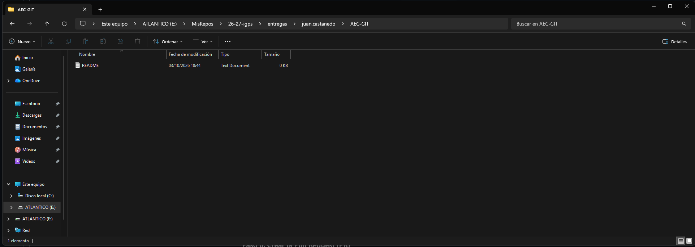

# Actividad AEC-GIT

## Introducción

En esta actividad se han practicado diferentes operaciones básicas de Git y GitHub.

## Paso 1 - Fork y clonación

Se realizó un fork del repositorio original proporcionado por el profesor y posteriormente se clonó el repositorio en el ordenador utilizando Git.

## Paso 2 - Creación de la estructura de carpetas

Se creó la carpeta `entregas`, seguida de la carpeta personal con el formato `juan.castanedo` y la carpeta `AEC-GIT`.

## Paso 3 - Primer commit

Se creó el archivo `README.md` y se añadió al área de staging utilizando `git add .`.

Posteriormente se realizó el commit obligatorio:

`docs: nuevo archivo`

